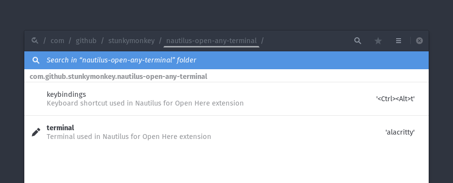

# nautilus-open-any-terminal

is an extension for nautilus, which adds an context-entry for opening other editor then `gnome-terminal`.

## Supported Terminal-Emulators

Right now the plugin is limited to only a few terminal-emulators. If one is missing please open an issue.

- `alacritty`
- `cool-retro-term`
- `gnome-terminal`
- `kitty`
- `konsole`
- `mlterm`
- `qterminal`
- `terminator`
- `terminology`
- `tilix`
- `xfce4-terminal`

## Installing

### From the AUR (Arch Linux)

```bash
yay -S nautilus-open-any-terminal
```


### From PYPI

User install:

```bash
pip install --user nautilus-open-any-terminal
```

System-wide install:

```bash
sudo pip install nautilus-open-any-terminal
```

Then kill Nautilus to allow it to load the new extension:

```bash
nautilus -q
```

If it does not work, try using the following command (from this repository):

```bash
sudo tools/update-extension-user.sh install    # for a user install
sudo tools/update-extension-system.sh install  # for a system-wide install
```

## Settings

### via dconf-editor



### via commandline

```bash
gsettings set com.github.stunkymonkey.nautilus-open-any-terminal terminal alacritty
gsettings set com.github.stunkymonkey.nautilus-open-any-terminal keybindings '<Ctrl><Alt>t'
```

