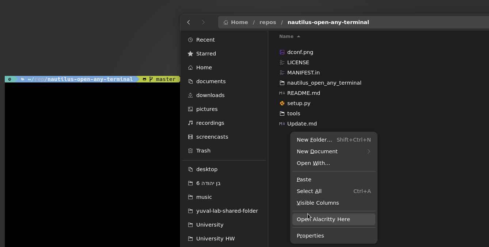

# nautilus-open-any-terminal

[](https://pepy.tech/project/nautilus-open-any-terminal)[](https://repology.org/project/nautilus-open-any-terminal/versions)

is an extension for nautilus, which adds an context-entry for opening other terminal emulators than `gnome-terminal`.



## Supported file managers
- Nautilus
- Caja

## Supported Terminal Emulators

The following terminal emulators are fully supported. PRs for other terminals
are welcome!

- `alacritty`
- `blackbox`
- `cool-retro-term`
- `contour`
- `deepin-terminal`
- `foot`/`footclient`
- `ghostty`
- `gnome-terminal`
- `guake`
- `kermit`
- `kgx` (GNOME Console)
- `kitty`
- `konsole`
- `mate-terminal`
- `mlterm`
- `ptyxis`
- `qterminal`
- `rio`
- `sakura`
- `st`
- `tabby`
- `terminator`
- `terminology`
- `terminus`
- `termite`
- `tilix`
- `urxvt`
- `urxvtc`
- `warp`
- `wezterm`
- `xfce4-terminal`
- `xterm`/`uxterm`

Additionally, the terminal can be set to `custom`, which allows you to set
custom commands for opening a local or remote terminal via dconf.

## Installing

### From the AUR (Arch Linux) [](https://repology.org/project/nautilus-open-any-terminal/versions)

```bash
yay -S nautilus-open-any-terminal
```

### Nixpkgs (NixOS) [](https://repology.org/project/nautilus-open-any-terminal/versions)
For configuration.nix (works without needing to enable Gnome DE)
```nix
programs.nautilus-open-any-terminal = {
  enable = true;
  terminal = "kitty";
};

environment = {
  sessionVariables.NAUTILUS_4_EXTENSION_DIR = "${pkgs.gnome.nautilus-python}/lib/nautilus/extensions-4";
  pathsToLink = [
    "/share/nautilus-python/extensions"
  ];

  systemPackages = with pkgs; [
    gnome.nautilus
    gnome.nautilus-python
  ];
};
```

### From PYPI [](https://repology.org/project/nautilus-open-any-terminal/versions)

Dependencies to install before:
- `nautilus-python` (`python-nautilus`/`python3-nautilus`(newer) package on Debian / Ubuntu)
- `gir1.2-gtk-4.0` (Debian / Ubuntu)
- `typelib-1_0-Gtk-4_0` (openSUSE)

User install:

```bash
pip install --user nautilus-open-any-terminal
```

System-wide install:

```bash
pip install nautilus-open-any-terminal
```
### For Debian/Ubuntu based Distros

Download the '.deb' package, for either Nautilus and or Caja from the [GitHub releases page](https://github.com/Stunkymonkey/nautilus-open-any-terminal/releases/latest).
After that install it either with the apt command:

```bash
apt install <package_name>.deb
```
Or depending on your Linux Distro, you can just double-click the '.deb' file and install it that way.
### From source
Requires [`gettext`](https://www.gnu.org/software/gettext/).

```sh
git clone https://github.com/Stunkymonkey/nautilus-open-any-terminal.git
cd nautilus-open-any-terminal
make

make install schema      # User install
sudo make install schema # System install
```
`install` installs this extension to extension directories of all supported file
managers. To avoid this, use `install-nautilus` or `install-caja` instead.

```sh
make install-nautilus schema # Install nautilus only
make install-caja schema # Install caja only
```

### restart nautilus

Then kill Nautilus to allow it to load the new extension:

```bash
nautilus -q
```

## Settings

To configure the plugin’s behaviour make sure to run (system-wide):

```bash
glib-compile-schemas /usr/share/glib-2.0/schemas
```

or for (user-wide) installation:

```bash
glib-compile-schemas ~/.local/share/glib-2.0/schemas/
```

### via dconf-editor


### via command-line

```bash
gsettings set com.github.stunkymonkey.nautilus-open-any-terminal terminal alacritty
gsettings set com.github.stunkymonkey.nautilus-open-any-terminal keybindings '<Ctrl><Alt>t'
gsettings set com.github.stunkymonkey.nautilus-open-any-terminal new-tab true
gsettings set com.github.stunkymonkey.nautilus-open-any-terminal flatpak system
```

## Uninstall
Since `setup.py` does not provide a natively uninstall method the makefile has an uninstall option.

```sh
make uninstall schema      # user uninstall
sudo make uninstall schema # system uninstall
```
